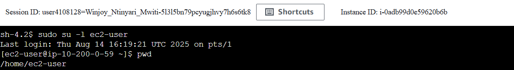
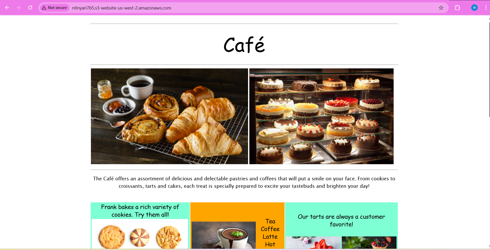
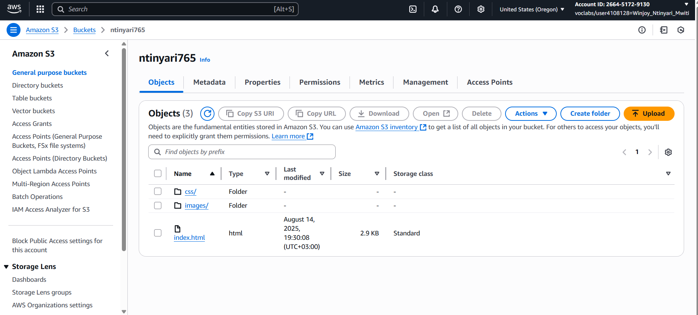
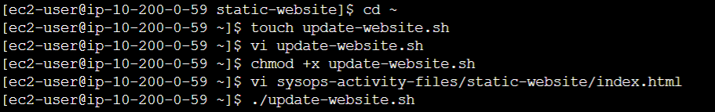
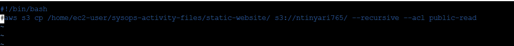

# AWS S3 Static Website Deployment Lab

## Overview
This project documents my experience deploying a static website to **Amazon S3** using the **AWS CLI** from an **Amazon EC2** instance.  
The lab simulates creating a website for a Café & Bakery and creating an update script for repeatable deployments.

---

## Objectives
By the end of this lab, I achieved the following:
- Ran AWS CLI commands that interact with Amazon S3.
- Created and configured an S3 bucket for website hosting.
- Uploaded static website files to the bucket.
- Enabled S3 static website hosting.
- Created a script to automate website updates.

---

## Lab Tasks

### **Task 1: Connect to an Amazon Linux EC2 instance using SSM**
Connected to the EC2 instance via AWS Systems Manager Session Manager.
```bash
sudo su -l ec2-user
pwd
```


### **Task 2: Configure AWS CLI**
Configured the AWS Command Line Interface (CLI) on an Amazon Linux EC2 instance for S3 operations.
```bash
aws configure
```

### **Task 3: Create S3 Bucket via AWS CLI**
Created a uniquely named S3 bucket in `us-west-2` region with proper configuration.
```bash
aws s3api create-bucket \
  --bucket <YOUR-BUCKET-NAME> \
  --region us-west-2 \
  --create-bucket-configuration LocationConstraint=us-west-2
```

### **Task 4: Extract Static Website Files**
Prepared the website files for deployment to S3 by extracting the lab-provided archive.
```bash
cd ~/sysops-activity-files
tar xvzf static-website-v2.tar.gz
cd static-website
ls
```


### **Task 5: Deploy Static Website to S3**
Configures S3 bucket for website hosting and uploads static website files with public access.
```bash
aws s3 website s3://<YOUR-BUCKET-NAME>/ --index-document index.html
aws s3 cp ./static-website/ s3://<YOUR-BUCKET-NAME>/ \
  --recursive \
  --acl public-read
aws s3 ls s3://<YOUR-BUCKET-NAME>/
```


The static website can be accessed at: http://<YOUR-BUCKET-NAME>.s3-website-us-west-2.amazonaws.com



After uploading files via AWS CLI, the bucket contents appear in the S3 Management Console as shown:



### **Task 6: Create Automated Deployment Script**

Creates a reusable bash script (`update-website.sh`) to sync local changes to the S3 bucket.
```bash
cd ~
touch update-website.sh
chmod +x update-website.sh  # Make executable
vi ~/sysops-activity-files/static-website/index.htm # Makes some changes to check if it updates
./update-website.sh
```

The update-website.sh script contains the aws s3 cp command
```
#!/bin/bash aws s3 cp /home/ec2-user/sysops-activity-files/static-website/ s3://<my-bucket>/ --recursive --acl public-read
```


## Conclusion
This lab demonstrated the complete process of deploying a static website to Amazon S3 using the AWS CLI from an EC2 instance. I successfully created and configured an S3 bucket, uploaded website files, enabled static website hosting, and verified the site’s accessibility through its public URL. Additionally, I created a reusable update script that automates the process of syncing new or modified files to the S3 bucket, ensuring efficient and repeatable deployments.
